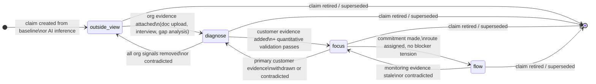

# Claim State Machine — Architecture Spec

**Status:** Decisions recorded — implementation in progress  
**Scope:** Strategic claim lifecycle, evidence requirements, object mapping, backwards compatibility  
**Does not cover:** MojoScore formula, scoring weights, UI rendering changes

---

## 1. State Machine

### 1.1 Four States

| State | Meaning | Analogous engagement phase |
|---|---|---|
| `outside_view` | Claim rests on inferred, public, or pre-engagement evidence only (the baseline artifact) | outside_signals / validate_outside |
| `diagnose` | Claim grounded by internal documents, stakeholder input, or gap analysis between outside and inside reads | diagnose / validate_diagnose |
| `focus` | Claim quantitatively validated — primary research, opportunity scoring, or triangulated customer evidence | focus / validate_focus |
| `flow` | Claim committed and acted on; monitoring evidence flowing back through a live route | flow / validate_flow |

The analogy to engagement phase is structural, not strict. A single engagement in the `flow` phase will have claims at all four states simultaneously — positioning claims may still be `outside_view` while a specific customer need is `flow`.

### 1.2 Allowed Transitions



### 1.3 Transition Invariants

- **Forward transitions** require evidence requirements (section 2) to be met. The system can check readiness but the actual transition is user-confirmed except for regressions.
- **Backward transitions** are automatic and non-blocking — triggered by evidence staleness or contradiction events. They do not delete evidence; they re-open the claim for re-validation.
- **Skipping states is not allowed.** A claim cannot jump from `outside_view` to `flow`. Each state gate enforces the previous state's evidence baseline.
- **Retiring** a claim is always allowed from any state. Retired claims are soft-deleted (flagged, not removed) to preserve provenance.

---

## 2. Evidence Requirements per Transition

### 2.1 Outside View → Diagnose

**What must be present:**

| Requirement | Field / Table | Specific condition |
|---|---|---|
| At least one organizational signal | `signals.signal_band = 'organization'` | `directness IN ('direct', 'inferred')` — weak-only org signals do not qualify |
| OR: an accepted file proposal with foundation areas | `file_proposals.status = 'accepted'` | `applied_areas` is non-empty |
| Signal speaks to claim topic | `claim_signal_refs` | at least one supporting ref (`relationship = 'supports'`) linking the org signal to this claim |
| Triangulation advances | `claims.triangulation_state` | must reach `'multi_source'` (≥2 supporting signals total, at least 1 from org band) |

**What does not count:**
- Baseline-only signals (`signal_band = 'outside'`, `source_type = 'public_baseline'`) — those keep the claim in `outside_view`
- `file_proposals` still in `'pending'` state
- Weak org signals alone (`directness = 'weak'`) without corroboration

**Regression trigger (Diagnose → Outside View):**
All `claim_signal_refs` entries with `signal_band = 'organization'` are either removed or flipped to `validation_status = 'contradicted'`, leaving the claim backed only by outside/baseline signals.

---

### 2.2 Diagnose → Focus

**What must be present:**

| Requirement | Field / Table | Specific condition |
|---|---|---|
| At least one customer-band signal | `signals.signal_band = 'customer'` | linked via `claim_signal_refs.relationship = 'supports'` |
| Triangulation: customer-backed | `claims.triangulation_state` | must reach `'customer_backed'` |
| No unaddressed contradictions | `claim_signal_refs.relationship = 'contradicts'` | all contradicting signals must have a `'qualifies'` counter-ref or the claim must be explicitly marked as having considered the contradiction |

**For need claims specifically** (`claim_type IN ('customer_outcome', 'unmet_need')`):

| Requirement | Field | Condition |
|---|---|---|
| ODI grammar formatted | `claims.need_statement` | non-null; must parse as: verb phrase + object of verb + contextual clarifier (example: "Minimize the time spent reconciling invoices when closing the month") |
| Importance scored | `odi_needs.importance` | integer 0–10, must be ≥ 1 (unscored = 0 blocks transition) |
| Satisfaction scored | `odi_needs.satisfaction` | integer 0–10, must be scored (not null/0 by default assumption) |
| Opportunity score computed | `odi_needs.opportunity_score` | = importance + max(0, importance − satisfaction) |

**For non-need claims** (positioning, strategy, capability, governance — any `claim_type` not in the need family):

| Requirement | Threshold |
|---|---|
| Customer signals | ≥2 customer-band signals with `directness IN ('direct', 'inferred')`, OR 1 direct customer signal + 1 org signal with `framing_fit = 'strong'` |
| Validation status | At least 1 signal must have `validation_status = 'validated'` (not just `'directional'`) |

ODI grammar is **not enforced** on non-need claims. See Open Questions §5.1 for how this decision was reached.

**Regression trigger (Focus → Diagnose):**
Primary customer-band signal supporting the claim is withdrawn (`claim_signal_refs` ref deleted) or contradicted (`validation_status = 'contradicted'`), dropping `triangulation_state` below `'customer_backed'`. For need claims: `importance` drops below 1 (rescored to essentially unimportant).

---

### 2.3 Focus → Flow

**What must be present:**

| Requirement | Field / Table | Specific condition |
|---|---|---|
| Action category assigned | `claims.action_category` | non-null; one of `'fix'`, `'improve'`, `'create'` |
| Route linked | `public.routes` | a route exists for this company with `linked_need_ids` containing this claim id, OR a `decision_routes` record links a `strategic_decision` backed by this claim to a route |
| Route has forward motion | `routes.steps_json` | at least one step with `status IN ('in_progress', 'complete')` |
| No commitment-blocker tension | `strategic_tensions` | no active tension with `is_commitment_blocker = true` AND `blocked_commitments` containing a route linked to this claim |
| Monitoring anchor defined | `managed_outcomes` OR `routes.steps_json` | at least one `managed_outcome` with matching `journey_key`, OR ≥1 complete/in-progress step |

**What does not count:**
- Route exists but has 0 started steps (hypothesis sitting in a column is not Flow)
- Route exists but is blocked by an unresolved commitment-blocker tension
- A `strategic_decision` in `'commit_ready'` state is not sufficient — must be `'committed'`

**Regression trigger (Flow → Focus):**
Any of: (a) `routes.stale_reason` becomes non-null on the linked route; (b) `dependency_state = 'stale'` on the route; (c) a new customer signal with `relationship = 'contradicts'` appears against the claim with `directness = 'direct'`; (d) the commitment-blocker tension is newly created against this claim's route.

---

## 3. Mapping Plan

### 3.1 Existing Objects → New Model

#### `public.claims` — **Reused as primary carrier, extended**

The `claims` table is the closest existing match to a first-class claim object.

| Existing field | Status | Notes |
|---|---|---|
| `id`, `company_id`, `statement`, `topic` | Reused unchanged | |
| `claim_type` | Reused | Values map naturally: `customer_outcome` / `unmet_need` → need claims; `route_candidate` → proto-Flow claim; `strategic_belief` → positioning/strategy claim |
| `outside_support_count`, `organization_support_count`, `customer_support_count` | Reused as denormalized cache | These are derived from `claim_signal_refs`; keep as fast-read fields |
| `triangulation_state` | Reused | Already captures the evidence breadth needed for state gate checks |
| `confidence` | Reused | Parallel concept to state; a `focus` claim can still have `confidence = 'low'` if validation is thin |
| `revalidation_flag` | Reused | Already serves as "needs re-check" signal — maps to the regression trigger concept |
| `raw_payload` | Reused | AI generation output; keep for provenance |

**New fields required:**

| New field | Type | Purpose |
|---|---|---|
| `state` | `text` CHECK IN ('outside_view','diagnose','focus','flow') | The core new attribute |
| `action_category` | `text` CHECK IN ('fix','improve','create') NULLABLE | Populated at Flow transition; null for earlier states |
| `need_statement` | `text` NULLABLE | ODI-formatted statement; only for need claims; distinct from `statement` which is the claim in plain language |
| `job_step_links` | `uuid[]` | Zero or more `job_steps.id` values this claim relates to; replaces the ad-hoc `linked_need_ids` arrays on routes |

---

#### `public.signals` + `public.claim_signal_refs` — **Reused as evidence chain**

This is the correct structure. No schema changes needed.

- `signal_band` (`outside` / `organization` / `customer`) maps directly to the three evidence tiers required by state transitions
- `directness`, `framing_fit`, `validation_status` are exactly the quality attributes used in transition gate checks
- `claim_signal_refs.relationship` (`supports` / `contradicts` / `qualifies`) covers the contradiction-resolution logic

The evidence chain for a claim is: `claims` → `claim_signal_refs` → `signals`.

---

#### `public.odi_needs` — **Reused as the materialized form of Focus-state need claims**

`odi_needs` rows are Focus-state claims where the need_statement has been ODI-formatted and the claim has been quantitatively scored. They are not a separate object — they are a projection of claims with `claim_type IN ('customer_outcome', 'unmet_need')` and `state = 'focus'`.

| odi_needs field | Maps to |
|---|---|
| `desired_outcome` | `claims.need_statement` (ODI-formatted) |
| `importance` / `satisfaction` / `opportunity_score` | Quantitative validation metadata (no direct claim field — stays on odi_needs) |
| `service_state` | Derived from importance/satisfaction ratio; not replicated to claims |
| `source_path` | Partially maps to signal provenance; `source_path = 'public_research'` → `signal_band = 'outside'`; `source_path = 'interview'` → `signal_band = 'customer'` |
| `journey_key` / `step_number` / `step_label` | Feeds `claims.job_step_links` (the step_number+journey_key locates the matching `job_steps.id`) |
| `frameworks_used`, `dependency_state`, `validation_state`, `evidence_state` | All carry forward unchanged |

**Relationship:** `odi_needs.id` ↔ `claims.id` should be 1:1 for need claims. The migration path (§4) handles bootstrapping this linkage.

---

#### `public.routes` — **Reused as the UI surface for Flow-state claims**

Routes do not disappear. They become the rendered form of committed (`flow`) claims.

| routes field | Maps to |
|---|---|
| `category` (`fix`/`improve`/`create`) | `claims.action_category` — the route's category IS the claim's action category |
| `linked_need_ids` | Migrated to `claims.job_step_links` (ids become job_step references, not need references) |
| `evidence_json` | Stays on routes as the execution-level evidence checklist (different from the claim evidence chain — routes track step-level evidence; claims track strategic evidence) |
| `assumptions_json` | Stays on routes; these are execution assumptions, not claim-level evidence |
| `route_insights_json` | Stays on routes; rendered from claim rationale + route execution state |
| `dependency_state`, `validation_state`, `evidence_state`, `stale_reason` | Feeds backward transitions (Flow → Focus) when stale |

**New field on routes:** `claim_id uuid NULLABLE` — links the route to its backing claim. One route = one primary claim (the committed direction). A route can be linked to multiple secondary claims via `linked_need_ids` (which continue as execution context).

---

#### `public.strategic_hypotheses` — **Reused; state maps directly**

Hypotheses are Outside View and Diagnose state claims before they have been formalized into `public.claims` rows. They serve as the pre-formalization holding area.

| hypothesis_state | Claim state equivalent |
|---|---|
| `inferred` | `outside_view` |
| `emerging` | `outside_view` (leaning toward diagnose; single org signal present) |
| `strengthened` | `diagnose` |
| `unstable` | Regression in progress (diagnose → outside_view or diagnose → focus pending re-validation) |
| `contradicted` | Not a state — triggers retirement or reframe |
| `reframed` | Creates a new claim, links via `reframed_from_hypothesis_id` |
| `retired` | Retired claim |

**Migration path:** `strategic_hypotheses` rows with `is_active = true` and `hypothesis_state IN ('inferred','emerging')` → create `claims` rows with `state = 'outside_view'`. Rows with `hypothesis_state = 'strengthened'` → `state = 'diagnose'`.

**Long-term:** `strategic_hypotheses` can be deprecated once the `claims` table carries the equivalent lifecycle. Not for v1 migration.

---

#### `public.strategic_tensions` — **Becomes derived-only; stored rows become a write-through cache**

Per the spec, tensions are not first-class objects. They are derived queries. The existing `strategic_tensions` table stays but changes role:

- `created_from = 'derived'` rows: treated as a materialized cache; invalidated when upstream claims/signals change
- `created_from = 'stored'` rows: deprecated — no new stored tensions after this migration
- `created_from = 'user_defined'` rows: preserved; user-authored tensions are valid but rendered differently in UI ("User-noted" vs. derived)

The three derived tension types under the new model:

| Tension type | Derivation query |
|---|---|
| Contradicting claims | Two `claims` rows with overlapping `topic`, `state ≥ diagnose`, where one has a `claim_signal_refs` entry with `relationship = 'contradicts'` pointing to a signal that `supports` the other |
| Under-evidenced claims | Claims where `state = X` but evidence requirements for state X are not fully met (transition gate check run in reverse) |
| Destabilized commitments | Claims with `state = 'flow'` where linked route has `stale_reason IS NOT NULL` or `dependency_state = 'stale'` |

---

#### `public.strategic_decisions` — **Overlaps with Focus→Flow transition; see Open Question §5.5**

`strategic_decisions` carries a rich sub-state machine (`exploratory` → `committed` → `destabilizing`). Under the new model this overlaps substantially with claim state transitions around Focus and Flow.

**For now:** `strategic_decisions` is retained unchanged. The relationship is: a `strategic_decision` with `decision_state = 'committed'` is a strong signal that its backing claims should be `flow`. The `decision_routes` junction maps committed decisions to their route surfaces.

A future consolidation pass may merge `strategic_decisions` into the claim state machine. See §5.5.

---

#### `public.positioning_canvases` + `public.strategy_cascades` — **Fields become claim statements**

These tables hold structured text that should be modeled as named claims:

| Field | Claim type | Expected state |
|---|---|---|
| `positioning_canvases.value_for_customer` | `strategic_belief` | diagnose or focus |
| `positioning_canvases.market_category` | `strategic_belief` | diagnose |
| `positioning_canvases.best_fit_customers` | `strategic_belief` | diagnose or focus |
| `positioning_canvases.unique_attributes` | `strategic_belief` | diagnose |
| `strategy_cascades.winning_aspiration` | `strategic_belief` | diagnose or focus |
| `strategy_cascades.where_to_play` | `strategic_belief` | diagnose |
| `strategy_cascades.how_to_win` | `strategic_belief` | diagnose or focus |
| `strategy_cascades.capabilities[].name` where `status = 'gap'` | `assumption` | outside_view |
| `strategy_cascades.assumptions[].assumption` where `tested = false` | `assumption` | outside_view |

**Migration path:** These fields are not deleted. They continue as the editable source of truth for the UX. Claims are created as a parallel provenance layer, not as a replacement for the structured canvas model. The two sync via the derivation engine (canvas save → upsert matching claim).

---

#### `public.evidenceBands` (TypeScript enum) — **Maps to state**

| EvidenceBand | Claim state |
|---|---|
| `hypothesis_only` | `outside_view` |
| `directional_not_validated` | `outside_view` (thin) / `diagnose` (grounded) |
| `customer_evidenced` | `focus` |
| `market_validated` | `focus` (strong) |
| `proven_path` | `flow` |
| `sustained_performance` | `flow` (mature) |

The `BAND_REACHABLE_CAP` and `BAND_UNLOCKABLE_CAP` score caps should be reviewed against the new state-distribution scoring approach (see §5.2). They are not deprecated yet.

---

### 3.2 Deprecation Register

| Object | Status | Notes |
|---|---|---|
| `strategic_tensions` rows with `created_from = 'stored'` | Deprecated | No new writes; existing rows readable |
| `file_proposals.status = 'rejected'` | Soft deprecated | Not relevant to claim state; keep for audit trail |
| `signals.structure_level = 'raw'` | Deprecated for gating | Only `'extracted'` or `'interpreted'` signals count toward transition gates |
| `strategic_hypotheses.hypothesis_kind = 'inferred_tension'` | Deprecated | Tensions are derived, not hypothesized |
| `claims.claim_type = 'route_candidate'` | Renamed | Should become `flow` state claims; the claim_type field is redundant once state is populated |

---

## 4. Backwards Compatibility — Cafe Barra Data

### 4.1 State Inference Rules

For every existing `odi_needs`, `routes`, and `strategic_hypotheses` row, initial state is inferred from current field values. This is a one-time migration; no data is mutated without the transition gate confirmation.

**OdiNeeds → Claim state:**

| Condition on odi_needs row | Inferred claim state |
|---|---|
| `source_path IN ('public_research', 'baseline')` AND importance = 0 | `outside_view` |
| `source_path IN ('public_research', 'baseline')` AND importance ≥ 1 | `diagnose` (outside signal, scored but not yet primary-research-backed) |
| `source_path IN ('interview', 'survey', 'primary')` AND importance ≥ 1 AND satisfaction ≥ 0 | `focus` |
| any row where company's `selected_route_id` references a route that has this need in `linked_need_ids` | `flow` |

**Routes → Claim state:**

| Condition on routes row | Inferred claim state |
|---|---|
| `id = company.selected_route_id` | `flow` |
| `steps_json` has ≥1 item with `status IN ('in_progress','complete')` but is not the selected route | `focus` (execution started, commitment not yet formalized) |
| `evidence_json` has ≥1 non-missing item, no steps started | `focus` |
| `evidence_json` is empty OR all items are `status = 'missing'` | `diagnose` |
| Route has `id.startsWith('derived-')` | `diagnose` (inferred from external research, not yet internally grounded) |

**StrategicHypotheses → Claim state:**

| hypothesis_state | Inferred claim state |
|---|---|
| `inferred` | `outside_view` |
| `emerging` | `outside_view` (edge: if `validation_state = 'directional'`, elevate to `diagnose`) |
| `strengthened` | `diagnose` |
| `unstable` | `diagnose` (flagged for revalidation — `revalidation_flag = true` on the created claim) |
| `contradicted` | Retired — create claim with `state = null` and soft-delete flag |
| `reframed` | Retired; the `superseded_by_id` chain creates the successor claim |
| `retired` | Skip — do not create a claim row |

**PositioningCanvas / StrategyCascade fields:**

All populated text fields → `diagnose` state claims initially. Rationale: they were authored inside the engagement (org-level work), which satisfies Diagnose requirements. They have not been customer-validated, so `focus` would be premature.

Exception: if a public baseline run exists for this company (`public_baselines` row present) and the field content closely matches baseline language (topic overlap via `detectStrategicThemes`), those specific fields start at `outside_view` pending org grounding.

### 4.2 Backwards-Compatibility Guarantees

1. **No existing UI breaks.** The `state` field is additive. Components that do not read `state` continue to work against unchanged tables.
2. **No data deleted.** All existing rows remain; `state` is populated in a migration pass, not a destructive rewrite.
3. **Scoring unchanged during migration.** The existing `mojo_score` calculation does not read `claims.state`. Score output is identical until the scoring integration is explicitly redesigned (see §5.2).
4. **Routes page unchanged.** The `routes` table gains a `claim_id` FK but the FK is nullable. The routes page continues to function with or without a linked claim.
5. **OdiNeeds page unchanged.** The `odi_needs` table gains no new fields in v1. The linkage to `claims` is via `odi_needs.id = claims.id` (1:1 after migration pass), populated in a join.

---

## 5. Open Questions and Trade-offs

These are decisions for you to make. Each is presented as a question with options and the trade-offs I see.

---

### 5.1 How do non-product strategic claims advance through Focus?

**The problem:** The Focus transition requires customer evidence. For need claims this is natural — opportunity scoring is the quantitative validation. But a claim like "We belong in the B2B mid-market category" or "Our competitive moat is speed-to-insight" does not have a natural ODI scoring equivalent. How does it earn `focus` state?

**Option A: Signal triangulation gate (recommended)**
A non-need claim reaches `focus` when it has ≥2 customer-band signals with `directness IN ('direct','inferred')`, regardless of ODI grammar. The `need_statement` field stays null. This is the simplest consistent rule — customer evidence is customer evidence, regardless of claim type.

*Trade-off:* The distinction between `diagnose` (1 org signal, 1 customer signal) and `focus` (2 customer signals) is a quantity difference, not a quality difference. There is no analogue to opportunity scoring that tells you *how* under- or over-served a strategic belief is.

**Option B: Add a `validation_method` discriminator**
Add `validation_method: 'odi_scored' | 'signal_triangulated' | 'market_tested' | null` to claims. Focus transition uses different gate logic per method. `odi_scored` → importance/satisfaction scored. `signal_triangulated` → ≥2 direct customer signals. `market_tested` → a validated signal exists with `evidence_type = 'quantitative'`.

*Trade-off:* More flexible and captures the qualitative difference in how types of claims get validated. Adds complexity — the gate checker needs to branch on method.

**Option C: Strategic claims stop at Diagnose**
Non-product claims (positioning, mission, governance, category) can only advance to `diagnose`. Only need claims and route-backing claims can reach `focus` and `flow`. Positioning and strategy live in a parallel "validated" vs "not yet validated" binary, not the four-state machine.

*Trade-off:* Simpler but creates a two-tier system. Positioning claims would never show up in the Flow distribution, making the state distribution skewed for companies that have strong positioning but few need claims.

---

### 5.2 How does the new state machine reconcile with Current / Reachable / Unlockable?

**The problem:** The existing scoring uses `EvidenceBand` to cap scores (`BAND_REACHABLE_CAP`, `BAND_UNLOCKABLE_CAP`). The new state machine creates a parallel hierarchy. They should not both compute authority independently.

**Option A: State distribution replaces evidence band (recommended for v2)**
Compute a `claim_state_distribution` per company: count of claims at each state. This distribution becomes the primary scoring input. `outside_view` claims cap scores at low potential; `flow` claims unlock high potential. The `EvidenceBand` enum becomes an internal implementation detail.

*Trade-off:* Requires rewriting score caps. Breaks Cafe Barra's current score until migration is complete. Higher risk.

**Option B: Map state distribution → evidence band (recommended for v1)**
Add a function `stateDistributionToBand(distribution)` that maps the distribution to the closest `EvidenceBand` and feeds the existing scoring unchanged. Example: if >50% of claims are `focus` or `flow`, band = `customer_evidenced`. This is a compatibility shim, not a permanent design.

*Trade-off:* Avoids score changes for Cafe Barra immediately. Introduces a mapping layer that will need to be removed in v2. Keeps the scoring and state machines separated, which is actually an advantage during the migration period.

**Option C: Run both in parallel, surface both in UI**
Keep `EvidenceBand` for scoring. Add state distribution as a new UI readout ("claim maturity breakdown") that does not feed scoring yet. Scoring integration is a future sprint.

*Trade-off:* Most conservative. Users see two different signals (score band vs. claim states) that may not align, which could be confusing. But it is the safest migration path and leaves the scoring team maximum flexibility.

My recommendation: Option B for v1 (shim), with Option A targeted for the scoring redesign sprint. Leave room in `area_scores_json` by adding a `claim_state_distribution` key now, even if it is not read by scoring yet.

---

### 5.3 Performance: Tensions as derived queries

**The problem:** `deriveStrategicTensions()` currently runs client-side on every render. It already queries routes, needs, positioning, strategy, and source signals. Under the new model, tensions must additionally traverse claim→signal→band relationships to check:
- Contradicting claims (requires scanning `claim_signal_refs` for relationship = 'contradicts')
- Under-evidenced claims (requires running transition gate checks per claim)
- Destabilized commitments (requires checking route staleness per claim)

For a company with 30 claims, 80 signals, and 20 signal refs per claim, this is ~1,600 ref lookups per derivation. Client-side, this is a problem.

**Option A: Keep client-side but add memoization (acceptable for v1 with <50 claims)**
`deriveStrategicTensions()` already receives its inputs as stable references. Add `claim_signal_refs` as an additional input with React Query caching. For small companies (Cafe Barra), performance is likely acceptable.

*Trade-off:* Will not scale past ~100 claims. Technical debt.

**Option B: Move derivation to a Supabase edge function, triggered on claim state change**
An `on_claim_state_change` trigger calls the edge function, which writes derived tensions to `strategic_tensions` (as a write-through cache). Client reads from the cache. Latency moves from render time to write time.

*Trade-off:* Eventual consistency — the tension cache lags behind by 1–5 seconds after a state change. More infrastructure to maintain.

**Option C: Postgres view for derived tensions (recommended)**
Write a SQL view `derived_tensions` that computes the three tension types as a query. Client fetches the view as a normal query. No edge function required, no staleness, no client-side computation.

*Trade-off:* The tension types that require text analysis (contradicting claims with overlapping topic) cannot be expressed in pure SQL and would fall back to client-side. But the structural tension types (under-evidenced, destabilized) can be fully expressed in SQL.

My recommendation: Option C for structural tensions, Option A for semantic tensions (contradictions require LLM or string matching). A hybrid: SQL view for deterministic tensions, client-side for semantic tensions.

---

### 5.4 How is `job_step_links` modeled?

**The problem:** The spec says each claim can reference zero or more `job_steps` rows. Currently `odi_needs` has `journey_key` + `step_number` (text/int, not FK to `job_steps.id`). Routes have `linked_need_ids` (string array of need IDs, not step IDs). Neither is a clean FK to `job_steps`.

**Option A: Junction table `claim_job_step_refs` (recommended)**
```sql
CREATE TABLE claim_job_step_refs (
  id          uuid PRIMARY KEY DEFAULT gen_random_uuid(),
  company_id  uuid NOT NULL,
  claim_id    uuid NOT NULL REFERENCES claims(id),
  job_step_id uuid NOT NULL REFERENCES job_steps(id),
  created_at  timestamptz DEFAULT now()
);
```
Clean relational design. Supports zero-to-many with full referential integrity.

*Trade-off:* New table. Migration required to populate from existing `odi_needs.journey_key` + `step_number` → `job_steps.id` lookups. Some odi_needs rows may not have a matching job_steps row (the step may not exist yet).

**Option B: `jsonb` array on claims**
Add `job_step_links uuid[]` to `claims`. No new table. Consistent with the existing array-of-id pattern (`linked_need_ids`, `linked_tension_ids`, `source_file_ids` on routes).

*Trade-off:* No referential integrity (FK check impossible on array). But consistent with the existing pattern across the schema. Easier to migrate.

**Option C: Reuse `odi_needs` as the step link for need claims; skip for other claims**
For need claims, the step link is already implicit: `odi_needs.journey_key` + `step_number` identifies the step. For non-need claims, step links are not required. No new field needed.

*Trade-off:* Loses the ability to link strategy or positioning claims to job steps, which is valuable for the strategic graph. Inconsistent — need claims and non-need claims have different relationship models.

---

### 5.5 Does `strategic_decisions` merge into the claim state machine?

**The problem:** `strategic_decisions` has its own state machine (`exploratory` → `under_validation` → `stabilizing` → `commit_ready` → `committed` → `destabilizing` → `reframing` → `retired`). This 8-state machine overlaps substantially with the Focus and Flow states of the claim model. A `committed` decision is essentially a claim in `flow` state. A `destabilizing` decision is a `flow` → `focus` regression.

**Option A: Merge in v2, keep separate in v1 (recommended)**
Leave `strategic_decisions` unchanged. Add a `linked_claim_id` FK to `strategic_decisions` so decisions can point to their backing claim. When a claim reaches `flow`, create or link a `committed` decision automatically. The two models run in parallel, with the decision as a human-facing commitment artifact and the claim as the provenance-tracking layer.

*Trade-off:* Some redundancy. The `confidence_movement` journal and `decision_memory` on `strategic_decisions` are valuable UX features that have no equivalent in the claim model yet.

**Option B: Deprecate strategic_decisions immediately**
Treat every `committed` decision as a `flow` claim. Move `confidence_movement` into claim event log (new `claim_events` table). Move `decision_memory` into claim-level notes.

*Trade-off:* High migration cost. `strategic_decisions` is referenced in `decision_routes`, `strategic_tensions.blocked_commitments`, and UI surfaces. A full removal is a significant refactor and is risky to do alongside the claim state machine introduction.

**Option C: Promote decisions to first-class claim specialization**
`strategic_decisions` is renamed to `committed_claims` and is the materialized form of Flow-state claims — the same relationship that `odi_needs` has to Focus-state need claims. Each `committed_claim` (formerly decision) has a 1:1 with a `claim` row.

*Trade-off:* Elegant long-term. Significant rename and schema migration in the short term.

---

### 5.6 MojoScore integration path — where to store state distribution?

The spec asks to "leave room" for state distribution to feed MojoScore eventually without designing the formula. The recommended reservation:

Add to `companies.area_scores_json` a new key `claim_state_distribution`:
```json
{
  "claim_state_distribution": {
    "outside_view": 12,
    "diagnose": 8,
    "focus": 5,
    "flow": 2,
    "total": 27,
    "computed_at": "2026-05-14T00:00:00Z"
  }
}
```

This is populated by the migration pass and updated whenever claim state changes. It is not read by scoring logic until explicitly wired. This preserves the current score output exactly while making the distribution queryable.

**Decision required:** Should `claim_state_distribution` be computed on demand (view), stored in area_scores_json (denormalized), or stored in a new dedicated column? The trade-offs:
- On demand: always current, no storage overhead, adds latency
- area_scores_json: consistent with existing pattern, slightly stale (re-computed on claim state change)
- Dedicated column: cleanest schema, requires migration

---

## Appendix: Terminology Alignment

| Spec term | Existing codebase equivalent | Notes |
|---|---|---|
| Claim | `claims` table + `strategic_hypotheses` (pre-formalization) | `claims` is the right table; hypotheses are the pre-claims staging area |
| Evidence chain | `claim_signal_refs` → `signals` | Already correct structure |
| State | New `claims.state` field | Not currently on claims |
| Action category | `routes.category` + new `claims.action_category` | Populated at Flow transition |
| Need statement | `odi_needs.desired_outcome` + new `claims.need_statement` | ODI-formatted; distinct from plain-language `claims.statement` |
| Job step link | `odi_needs.journey_key` + `step_number` (implicit) | Formalize as FK to `job_steps.id` |
| Tension (derived) | `src/lib/tensionDerivation.ts` output | Correct; not a stored object |
| Route | `public.routes` | Flow-state claim UI surface; unchanged |
| Engagement phase | `companies.program_phase` | Phase of the engagement; claim state is a per-claim attribute, not the engagement phase |
